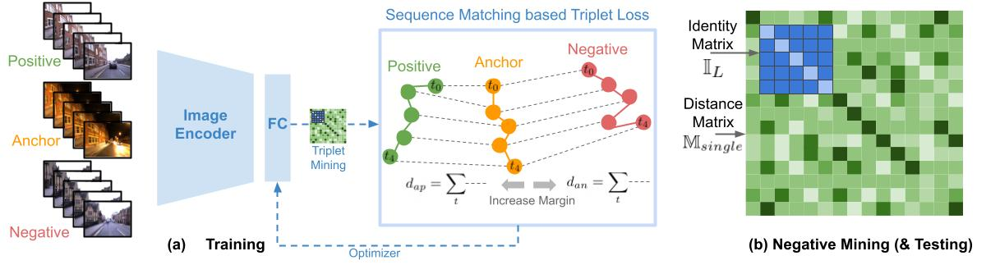

# SeqMatchNet
Code for the CoRL 2021 Oral paper "SeqMatchNet: Contrastive Learning with Sequence Matching for Place Recognition and Relocalization"

[[OpenReview](https://openreview.net/forum?id=OQMXb0xiCrt)] [[PDF](https://openreview.net/pdf?id=OQMXb0xiCrt)] [[CoRL 2021 YouTube Video](https://www.youtube.com/watch?v=Rb2Tbu72rG0)]

<p align="center">
  
    <br/><em>SeqMatchNet: Contrastive Learning with Sequence Matching.</em>
</p>

## Setup
### Conda
```bash
conda create -n seqnet numpy pytorch=1.8.0 torchvision tqdm scikit-learn faiss tensorboardx h5py wandb -c pytorch -c conda-forge
```

### Download
Run `bash download.sh` to download single image NetVLAD descriptors (3.4 GB) for the Nordland-clean dataset <sup>[[a]](#nordclean)</sup> and the Oxford dataset (0.3 GB) <sup>[[b]](#saveLoc)</sup>.
## Run

### Train
To train SeqMatchNet on the Oxford dataset with both the loss and negative mining based on sequence matching:
```python
python main.py --mode train --seqL 5 --pooling --dataset oxford-v1.0 --loss_trip_method meanOfPairs --neg_trip_method meanOfPairs --expName ox10_MoP_negMoP
```
For the Nordland dataset:
```python
python main.py --mode train --seqL 5 --pooling --dataset nordland-sw --loss_trip_method meanOfPairs --neg_trip_method meanOfPairs --expName nord-sw_MoP_negMoP
```

To train without sequence matching:
```python
python main.py --mode train --seqL 5 --pooling --dataset oxford-v1.0 --loss_trip_method centerOnly --neg_trip_method centerOnly --expName ox10_CO_negCO
```

### Test
```python
python main.py --mode test --seqL 5 --pooling -dataset oxford-v1.0 --split test --resume ./data/runs/<name_of_the_model_file>
```

## Acknowledgement
The code in this repository is based on [oravus/seqNet](https://github.com/oravus/seqNet) and [Nanne/pytorch-NetVlad](https://github.com/Nanne/pytorch-NetVlad).

## Citation
```
@inproceedings{garg2021seqmatchnet,
  title={SeqMatchNet: Contrastive Learning with Sequence Matching for Place Recognition \& Relocalization},
  author={Garg, Sourav and Vankadari, Madhu and Milford, Michael},
  booktitle={5th Annual Conference on Robot Learning},
  year={2021}
}
```

#### Other Related Projects
[oravus/seqNet](https://github.com/oravus/seqNet)
[Delta Descriptors (2020)](https://github.com/oravus/DeltaDescriptors);
[Patch-NetVLAD (2021)](https://github.com/QVPR/Patch-NetVLAD);
[CoarseHash (2020)](https://github.com/oravus/CoarseHash);
[seq2single (2019)](https://github.com/oravus/seq2single);
[LoST (2018)](https://github.com/oravus/lostX)

<a name="nordclean">[a]<a> This is the clean version of the dataset that excludes images from the tunnels and red lights and can be downloaded from [here](https://cloudstor.aarnet.edu.au/plus/s/8L7loyTZjK0FsWT).

<a name="saveLoc">[b]<a> These will automatically save to `./data/`, you can modify this path in [download.sh](https://github.com/oravus/seqNet/blob/main/download.sh) and [get_datasets.py](https://github.com/oravus/seqNet/blob/5450829c4294fe1d14966bfa1ac9b7c93237369b/get_datasets.py#L6) to specify your workdir.
